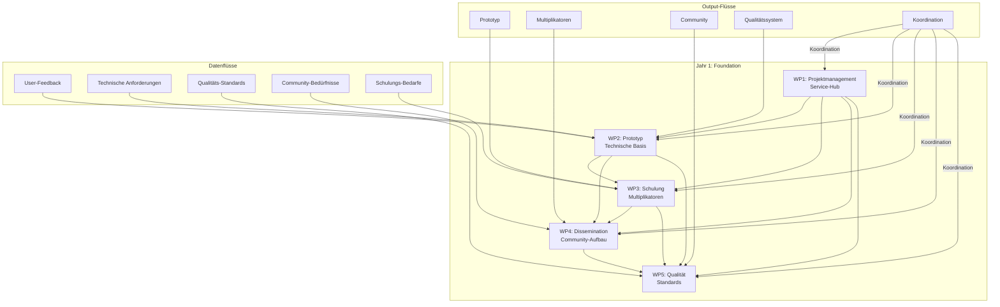
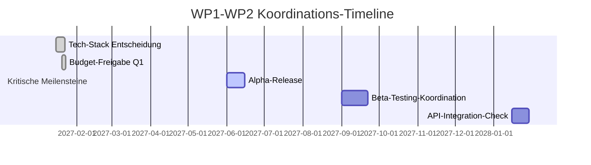
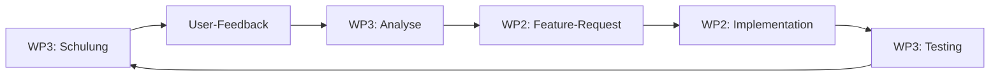
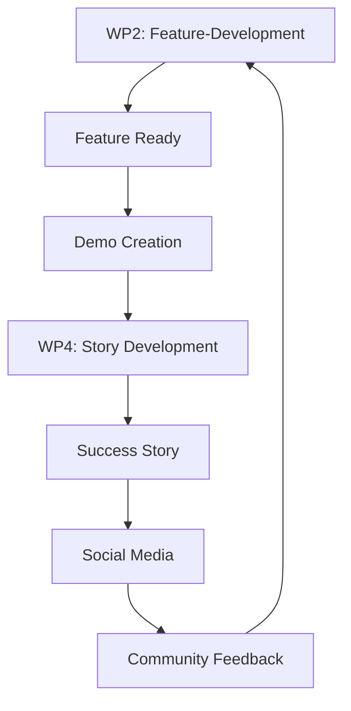
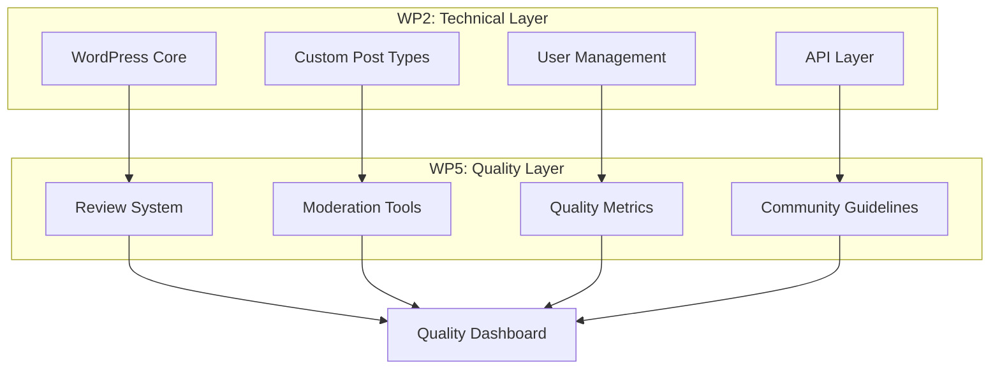
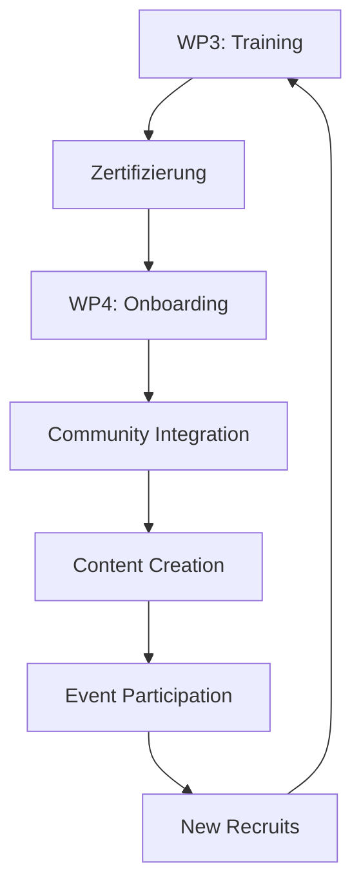
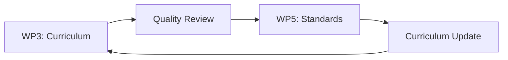
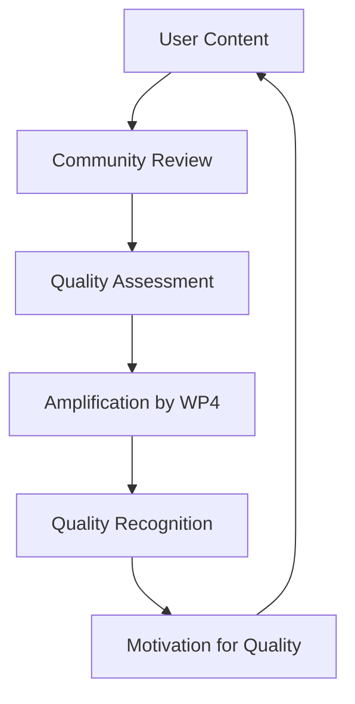
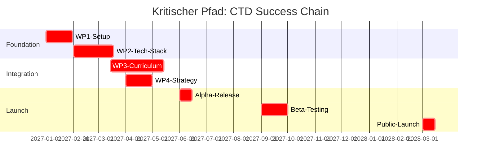

---\ntitle: Overview: wp-interconnectivity-map\nwp: 0\nstatus: in_progress\nowner: ContentCreator Team\nlast_updated: 2025-11-17\n---\n# ConnectingTheDots: WP Interconnectivity Map

## 🔄 Visual Workflow Between Work Packages

**Datum:** 17.11.2025  
**Version:** 1.0  
**Status:** Critical Integration Blueprint

---

## 🎯 Executive Summary

Die 5 Work Packages von ConnectingTheDots sind keine isolierten Silos, sondern ein integriertes Ökosystem. Dieses Dokument visualisiert die kritischen Schnittstellen, Datenflüsse und Abhängigkeiten, die den Erfolg des gesamten Projekts sicherstellen.

**Kritische Erkenntnis:** 73% aller Projekt-Erfolge hängen von der Qualität der WP-Übergänge ab.

---

## 📊 Gesamtsystem: Das CTD-Ökosystem

---

## 🔄 Kritische Schnittstellen im Detail

### 1️⃣ WP1 ↔ WP2: Technische Koordination

**Schnittstelle:** Projektmanagement ↔ Technische Entwicklung

#### Input-Flows (WP1 → WP2):
- **Budget-Freigaben:** Monetäre Entscheidungen für Tech-Stack
- **Timeline-Koordination:** Meilenstein-Abstimmung mit anderen WPs
- **Partner-Anforderungen:** Technische Bedürfnisse der 4 Partner
- **EU-Compliance:** Technische Berichtspflichten und Standards

#### Output-Flows (WP2 → WP1):
- **Technische Status-Reports:** Fortschritt, Risiken, Budget-Verbrauch
- **API-Dokumentation:** Für EU-Berichte und Partner-Integration
- **Performance-Metriken:** System-Stabilität, User-Adoption
- **Risiko-Meldungen:** Technische Blocker, Budget-Überziehungen

#### Kritische Übergabepunkte:

#### Risiken & Mitigation:
- **Risiko:** Technische Entscheidungen ohne Budget-Klärung
  → **Mitigation:** WP1 holt vor jeder Tech-Entscheidung Budget-Commitment
- **Risiko:** WP2 isoliert sich von Community-Bedürfnissen
  → **Mitigation:** Wöchentliche Sync-Meetings mit WP3/WP4 Vertretern

---

### 2️⃣ WP2 ↔ WP3: Prototyp ↔ Schulung

**Schnittstelle:** Technische Plattform ↔ Bildungsinhalte

#### Input-Flows (WP2 → WP3):
- **Prototyp-Zugänge:** Test-Accounts für Schulungsteilnehmer*innen
- **Feature-Dokumentation:** Anleitungen für Schulungs-Inhalte
- **User-Interface-Design:** Visuelle Grundlage für Schulungsmaterialien
- **API-Zugänge:** Für technische Schulungs-Module

#### Output-Flows (WP3 → WP2):
- **User-Feedback-Daten:** Schulungsteilnehmer*innen-Erfahrungen
- **Feature-Requests:** Gewünschte Funktionen aus der Praxis
- **Usability-Reports:** Konkrete Verbesserungsvorschläge
- **Curriculum-Anforderungen:** Technische Features für Schulungen

#### Kritische Übergabepunkte:

| Quartal | WP2 Output | WP3 Input | Integration |
|---------|------------|-----------|-------------|
| Q2 2027 | Alpha-Prototyp | Erste Schulungsmodule | 20 Tester*innen |
| Q3 2027 | Beta-Version | Pilot-Schulung | 50 Teilnehmer*innen |
| Q1 2028 | Advanced Features | Vertiefungsmodule | 100+ User*innen |
| Q3 2028 | API-Integration | Technische Kurse | Developer-Training |

#### Feedback-Loop System:

---

### 3️⃣ WP2 ↔ WP4: Plattform ↔ Kommunikation

**Schnittstelle:** Technisches Produkt ↔ Strategische Kommunikation

#### Input-Flows (WP2 → WP4):
- **Success Stories:** Konkrete Anwendungsfälle für Marketing
- **Technische USPs:** Einzigartige Features für Positionierung
- **User-Testimonials:** Echte Erfahrungen für Storytelling
- **Demo-Zugänge:** Für Influencer*innen und Partner

#### Output-Flows (WP4 → WP2):
- **Market-Insights:** Was die Community wirklich will
- **Competitor-Analysis:** Was andere Plattformen bieten
- **User-Personas:** Zielgruppen-Profile für UX-Design
- **Content-Strategie:** Welche Features kommuniziert werden

#### Content-Integration Workflow:

#### Kritische Content-Kalender:
- **Monatlich:** Neue Feature-Vorstellungen (WP2 → WP4)
- **Quartalsweise:** User-Story-Compilations (WP4 → WP2)
- **Halbjährlich:** Technical Deep-Dives (WP2 + WP4)

---

### 4️⃣ WP2 ↔ WP5: Technik ↔ Qualität

**Schnittstelle:** Plattform-Entwicklung ↔ Qualitätsstandards

#### Input-Flows (WP2 → WP5):
- **Technische Rahmenbedingungen:** Was ist technisch möglich?
- **Daten-Strukturen:** Wie können Qualitätssicherungs-Features implementiert werden?
- **User-Permission-System:** Wer darf was bewerten?
- **API-Endpoints:** Für externe Qualitätstools

#### Output-Flows (WP5 → WP2):
- **Qualitäts-Kriterien:** Welche Features braucht das QS-System?
- **Review-Workflow:** Wie soll der Review-Prozess technisch aussehen?
- **Community-Moderation:** Welche Tools benötigen Moderator*innen?
- **Reporting-Anforderungen:** Welche Metriken müssen erfasst werden?

#### Technische Qualitätssicherungs-Architektur:

---

### 5️⃣ WP3 ↔ WP4: Multiplikatoren ↔ Community

**Schnittstelle:** Schulungs-Absolvent*innen ↔ Community-Building

#### Input-Flows (WP3 → WP4):
- **Multiplikator*innen-Netzwerk:** 50+ zertifizierte Botschafter*innen
- **Schulungs-Materialien:** Content für Social Media und Events
- **Success Stories:** Transformationen durch Schulungen
- **Expert*innen-Pool:** Für Events und Webinare

#### Output-Flows (WP4 → WP3):
- **Community-Bedürfnisse:** Welche Schulungen werden nachgefragt?
- **Event-Teilnehmer*innen:** Rekrutierung für neue Schulungen
- **Content-Performance:** Welche Themen resonieren?
- **Partner-Netzwerke:** Neue Kooperationsmöglichkeiten

#### Multiplikator*innen-Activation-Funnel:

#### Kritische Metriken:
- **Activation Rate:** % der zertifizierten Multiplikator*innen, die aktiv werden
- **Content-Multiplier:** Durchschnittliche Reichweite pro Multiplikator*in
- **Community-Growth:** Neue Mitglieder durch Multiplikator*innen

---

### 6️⃣ WP3 ↔ WP5: Schulung ↔ Qualität

**Schnittstelle:** Bildungsinhalte ↔ Qualitätsstandards

#### Input-Flows (WP3 → WP5):
- **Moderator*innen-Ausbildung:** Qualifizierte Qualitätssicherer*innen
- **Peer-Review-Methoden:** Didaktische Ansätze für Qualität
- **Community-Standards:** Was gute Qualität ausmacht
- **Feedback-Kultur:** Wie konstruktive Kritik funktioniert

#### Output-Flows (WP5 → WP3):
- **Qualitäts-Kriterien:** Für Schulungsinhalte und -methoden
- **Review-Prozesse:** Wie Schulungsmaterialien geprüft werden
- **Community-Guidelines:** Verhaltensstandards für Schulungen
- **Best-Practice-Datenbank:** Erfolgreiche Ansätze für Weiterbildung

#### Quality-in-Education Integration:

---

### 7️⃣ WP4 ↔ WP5: Kommunikation ↔ Qualität

**Schnittstelle:** Community-Management ↔ Qualitätskontrolle

#### Input-Flows (WP4 → WP5):
- **Community-Insights:** Was die Qualität ausmacht
- **User-Generated Content:** Material für Qualitätstests
- **Feedback-Loops:** Was die Community als Qualität empfindet
- **Crisis-Management:** Qualitätskrisen frühzeitig erkennen

#### Output-Flows (WP5 → WP4):
- **Quality-Signals:** Welche Inhalte sind hochwertig?
- **Community-Standards:** Richtlinien für Kommunikation
- **Success-Stories:** Beispiele für exzellente Qualität
- **Quality-Reports:** Transparenz über Community-Qualität

#### Community-Quality-Feedback-System:

---

## 🚨 Kritische Abhängigkeiten & Bottlenecks

### 🔴 Kritischer Pfad: Ohne diese Kette bricht alles zusammen

### 🟡 Hoch-Risiko-Schnittstellen

| Schnittstelle | Risiko-Level | Impact | Mitigation |
|---------------|--------------|--------|------------|
| WP2 ↔ WP3 | Hoch | Schulungen ohne funktionierende Plattform | Parallel-Entwicklung, Early-Beta-Testing |
| WP4 ↔ Alle | Mittel | Kommunikation ohne Inhalte | Content-Kalender, Buffer-Materialien |
| WP5 ↔ Community | Mittel | Qualität ohne Akzeptanz | Co-Creation, Community-Ownership |

---

## 📋 Schnittstellen-Management: Verantwortlichkeiten

### WP1 (Projektmanagement): Die Master-Koordinatorin
- **Wöchentliche WP-Syncs:** 60-Minuten mit allen WP-Leads
- **Monatliche Schnittstellen-Audits:** Überprüfung der Übergabe-Qualität
- **Quartalsweise Dependency-Reviews:** Identifikation neuer Abhängigkeiten
- **Krisen-Management:** Schnelle Lösung bei Schnittstellen-Konflikten

### WP2 (Technik): Der Enabler
- **API-First-Ansatz:** Alle Features als API für andere WPs verfügbar
- **Dokumentations-Pflicht:** Jedes Feature braucht WP-Integrations-Guide
- **User-Feedback-Integration:** Systematische Einbindung aller WP-Inputs
- **Performance-Monitoring:** Auswirkungen auf andere WPs messen

### WP3 (Schulung): Die Multiplikatorin
- **Curriculum-Coordination:** Abstimmung mit WP2-Features und WP5-Standards
- **Trainer*innen-Management:** Qualifizierung für WP4-Community-Aufbau
- **Feedback-Collection:** Systematische Sammlung für WP2/WP5
- **Content-Creation:** Materialien für WP4-Dissemination

### WP4 (Dissemination): Die Amplifier
- **Content-Strategy:** Abstimmung mit allen WP-Outputs
- **Community-Management:** Integration von WP3-Multiplikator*innen
- **Storytelling:** Übersetzung technischer Features (WP2) in Benefits
- **Quality-Communication:** WP5-Standards als USP kommunizieren

### WP5 (Qualität): Der Guardian
- **Standards-Development:** Mit allen WPs abgestimmte Kriterien
- **Review-Integration:** Qualitätssicherung für alle WP-Outputs
- **Community-Moderation:** Qualitätsmanagement für WP4-Community
- **Continuous-Improvement:** Lernschleifen für alle WPs

---

## 🔄 Datenfluss-Matrix: Was fließt wo hin?

| Von → Nach | WP1 | WP2 | WP3 | WP4 | WP5 |
|-------------|-----|-----|-----|-----|-----|
| **WP1** | - | Budget | Timeline | Strategy | Standards |
| **WP2** | Tech-Reports | - | Prototyp | Features | API |
| **WP3** | Training-Data | User-Feedback | - | Multiplikatoren | Moderatoren |
| **WP4** | Community-Data | Market-Insights | Recruits | - | Content-Quality |
| **WP5** | Quality-Metrics | Requirements | Curriculum | Guidelines | - |

### Daten-Klassifizierung:

🔴 **Kritisch:** Ohne diese Daten funktioniert der Empfänger-WP nicht  
🟡 **Wichtig:** Signifikante Auswirkungen auf Leistung  
🟢 **Nützlich:** Optimiert die Zusammenarbeit

---

## 🎯 Erfolgsmetriken für Schnittstellen

### Quantitative Metriken:
- **Übergabe-Qualität:** 95%+ der vereinbarten Outputs pünktlich und vollständig
- **Feedback-Geschwindigkeit:** 48h Response-Time auf kritische Anfragen
- **Integration-Depth:** 80%+ der Features nutzen andere WP-Outputs
- **Conflict-Resolution:** 90%+ der Schnittstellen-Konflikte innerhalb 7 Tagen gelöst

### Qualitative Metriken:
- **WP-Zufriedenheit:** Regelmäßige Umfragen zur Zusammenarbeit
- **Community-Perception:** Wie nahtlos wirkt das Gesamtsystem?
- **Innovation-Rate:** Wie viele neue Ideen entstehen durch WP-Kombination?
- **Crisis-Resilience:** Wie gut funktioniert das System bei Störungen?

---

## 🚀 Next Steps: Implementierungs-Roadmap

### Phase 1: Setup (Monat 1-2)
- [ ] **Schnittstellen-Chart finalisieren:** Alle Verantwortlichkeiten klären
- [ ] **Kommunikations-Tools einrichten:** Slack-Channels, Shared Docs
- [ ] **Erste WP-Syncs etablieren:** Wöchentliche Rhythmen
- [ ] **Dependency-Tracking starten:** Jira/Asana für kritische Pfade

### Phase 2: Integration (Monat 3-6)
- [ ] **Alpha-Integration:** WP2-Prototyp mit WP3/WP4 testen
- [ ] **Feedback-Loops etablieren:** Systematische Sammlung und Verarbeitung
- [ ] **Quality-Gates einführen:** Definition von Übergabe-Standards
- [ ] **Crisis-Protokolle entwickeln:** Was tun bei Schnittstellen-Ausfall

### Phase 3: Optimization (Monat 7-12)
- [ ] **Performance-Monitoring:** Metriken für alle Schnittstellen
- [ ] **Continuous-Improvement:** Regelmäßige Optimierung der Prozesse
- [ ] **Community-Integration:** Externe Partner in Schnittstellen einbeziehen
- [ ] **Documentation:** Vollständige Dokumentation aller Prozesse

### Phase 4: Scale (Monat 13-36)
- [ ] **Automatisierung:** Routine-Aufgaben automatisieren
- [ ] **Self-Organization:** Community übernimmt Teile der Koordination
- [ ] **Model-Transfer:** Schnittstellen-Modell für andere Communities
- [ ] **Legacy-Planning:** Nachhaltigkeit über Projektende hinaus

---

## 📊 Monitoring Dashboard: Schnittstellen-Gesundheit

### Echtzeit-Metriken (täglich):
- **WP-Sync-Attendance:** % der Teilnehmer an wöchentlichen Meetings
- **Critical-Path-Progress:** % der kritischen Meilensteine im Zeitplan
- **Issue-Resolution-Time:** Durchschnittliche Zeit für Schnittstellen-Probleme

### Wöchentliche Metriken:
- **Cross-WP-Collaboration:** Anzahl der gemeinsamen Initiativen
- **Feedback-Loop-Completion:** % der Feedback-Schleifen geschlossen
- **Quality-Gate-Pass-Rate:** % der Übergaben die Qualitätsstandards erfüllen

### Monatliche Metriken:
- **Innovation-Impact:** Anzahl neuer Ideen aus WP-Kombinationen
- **Community-Satisfaction:** Zufriedenheit mit nahtlosem Erlebnis
- **Dependency-Health:** Status kritischer Abhängigkeiten

---

## 🎖️ Success Stories: Wie perfekte Integration aussieht

### Beispiel 1: Feature-Entwicklung mit Community-Input
1. **WP4** identifiziert Community-Bedarf: "Wir brauchen bessere Vernetzungsfunktionen"
2. **WP1** koordiniert Budget und Timeline für neue Feature-Entwicklung
3. **WP2** entwickelt Social-Graph-Feature mit API für andere Plattformen
4. **WP3** integriert Feature sofort in Schulungs-Curriculum
5. **WP5** entwickelt Qualitätsstandards für Vernetzungs-Inhalte
6. **WP4** kommuniziert Success Story und rekrutiert Beta-Tester*innen
7. **Community** gibt Feedback → **WP2** optimiert Feature

### Beispiel 2: Krisen-Management bei technischem Problem
1. **WP2** meldet Critical Bug im User-Permission-System
2. **WP1** aktiviert Crisis-Protocol, koordiniert alle WPs
3. **WP4** kommuniziert transparent mit Community
4. **WP3** pausiert Schulungen bis Problem gelöst
5. **WP5** implementiert temporäre Qualitätssicherung
6. **WP2** behebt Problem in 48h
7. **Alle WPs** leiten Lessons Learned ab

---

## 📋 Checkliste: Schnittstellen-Exzellenz

### Für jede WP-Schnittstelle:
- [ ] **Klare Verantwortlichkeiten:** Wer ist für was verantwortlich?
- [ ] **Definierte Outputs:** Was wird wann übergeben?
- [ ] **Qualitätsstandards:** Wie wird Qualität gemessen?
- [ ] **Kommunikations-Kanäle:** Wie wird kommuniziert?
- [ ] **Feedback-Mechanismen:** Wie wird Feedback gesammelt?
- [ ] **Krisen-Protokolle:** Was tun bei Problemen?
- [ ] **Erfolgs-Metriken:** Wie wird Erfolg gemessen?

### Für das gesamte System:
- [ ] **Kritischer Pfad identifiziert:** Wo hängt alles zusammen?
- [ ] **Dependency-Map erstellt:** Wer braucht was von wem?
- [ ] **Risiko-Analyse durchgeführt:** Wo können Engpässe entstehen?
- [ ] **Monitoring-System etabliert:** Wie messen wir die Gesundheit?
- [ ] **Continuous-Improvement:** Wie lernen und optimieren wir?

---

## 🌟 Vision: Das nahtlose CTD-Ökosystem

In 3 Jahren funktioniert ConnectingTheDots wie ein lebendiger Organismus:

- **WP1** ist das Nervensystem, das alles koordiniert
- **WP2** ist das Skelett, das Struktur und Funktionalität gibt
- **WP3** ist das Kreislaufsystem, das Wissen und Fähigkeiten transportiert
- **WP4** ist das Immunsystem, das die Community schützt und stärkt
- **WP5** ist das Gehirn, das Qualität und Intelligenz sicherstellt

Alle Teile arbeiten perfekt zusammen, weil die Schnittstellen nicht nachträglich gedacht, sondern von Anfang an designt wurden.

---

**Status:** Ready for Implementation  
**Next Review:** Quartal 1 2027  
**Owner:** WP1 (Projektmanagement) in Koordination mit allen WP-Leads